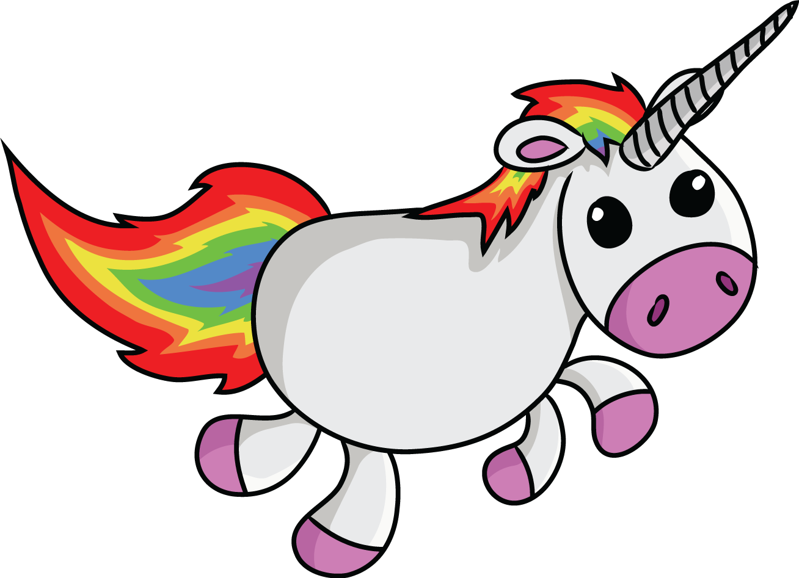
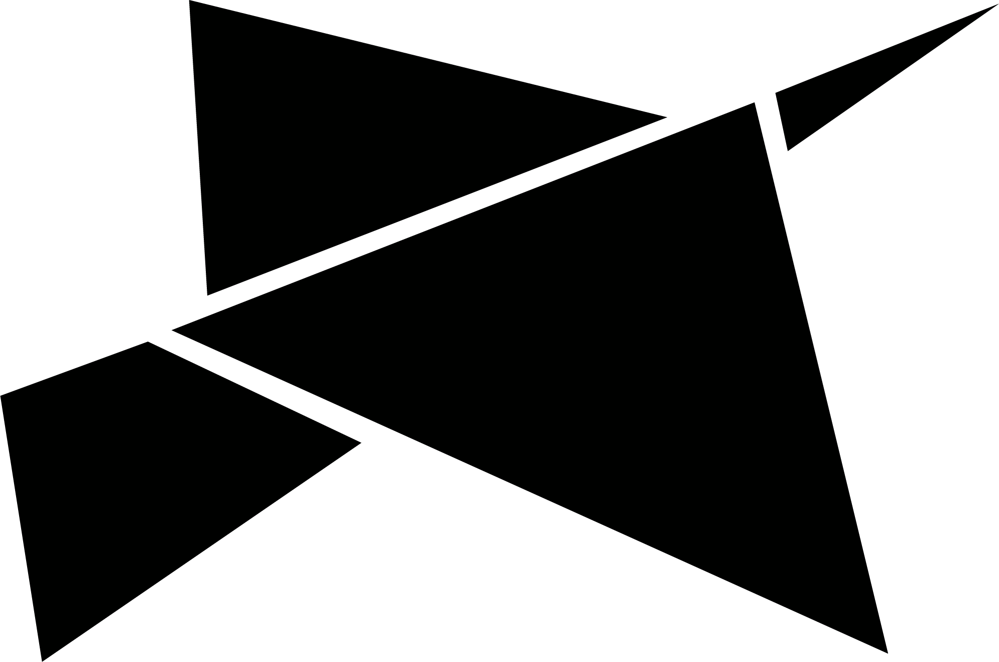

# Flappy Unicorn Game

This is a guide for making Flappy Unicorn Game. Just follow this guide and at the end you will have created a game!

---

# 0. **Getting Started**

## 0.1. **Download project from GitHub**

Either:

- Clone the project if you're familiar with git, or
- Download project by clicking the green button named “Clone or download”. When a small dialogue appears, click “Download ZIP”. Unzip the folder.

## 0.2. **Install Visual Studio Code**

Download Visual Studio Code from https://code.visualstudio.com/ and install it. Start Visual Studio Code and open the unzipped folder of the project.

## 0.3. **Install Live Server**

In Visual Studio Code you can install [Live Server](https://marketplace.visualstudio.com/items?itemName=ritwickdey.LiveServer) as an extension from the Visual Studio Code Marketplace, by clicking this [link](https://marketplace.visualstudio.com/items?itemName=ritwickdey.LiveServer), or by finding it among Visual Studio Code's extensions.

## 0.4. **Start Live Server**

After Live Server is installed, you should be able to click “Go Live” in the bottom right corner of the Visual Studio Code editor.

## 0.5 **How to read code examples**

To help you, we have predefined all methods and variables you need in the JavaScript files. In the code examples, we will use `/* ... */` as a comment to let you know when there is written code earlier but we don't want to show all of it.

---

# 1. **Create game**

We will use a library called **p5.js** to create our game. To get an intro to **p5.js** or see more information, visit https://p5js.org/get-started/.

We have already imported **p5.js** into our project, by simply adding `https://cdn.jsdelivr.net/npm/p5@0.10.2/lib/p5.js` in a `<script>` tag in `index.html`.

You can go to `index.html` and look.

In `index.html` we have also added all our custom files that we will be using: `index.js`, `unicorn.js`, `pipe.js`, and `boid.js`.

In `index.js` we have predefined all the main **methods** and **variables** for our game.

---

## 1.1. **Load images**

First we load the images we will be using.

- Open index.js. Go to function preload().
- We want to load images into our game.
- We can use **p5.js** method [loadImage()](https://p5js.org/reference/#/p5/loadImage).

**`index.js`**

```js
function preload() {
  backgroundImg = loadImage("images/background.png");
  unicornImg = loadImage("images/unicorn.png");
  boidImg = loadImage("images/boid.png");
}
```

**What's happening here?**

We load images from the folder `images` and place them in the variables `backgroundImg`, `unicornImg` and `boidImg`. The declaration (creation) of the variables can be found at the top of `index.js`.

We can however not see any change to our game yet - we don't use the images anywhere, we have just loaded them into variables.

---

## 1.2. **Create a canvas**

Now we create a canvas, the canvas is where the game is "drawn".

- With **p5.js** we can use their [createCanvas()](https://p5js.org/reference/#/p5/createCanvas) function.
- We pass our predefined variables `CANVAS_HEIGHT` and `CANVAS_WIDTH` as arguments.

**`index.js`**

```js
function setup() {
  createCanvas(CANVAS_WIDTH, CANVAS_HEIGHT);
}
```

- Open browser. Check that we have a empty canvas that is about twice as high as it is wide.

**What's happening here?**

We create a canvas using the variables `CANVAS_WIDTH` and `CANVAS_HEIGHT` which can be found at the top of `index.js`. The canvas is where we will draw all our graphics.

---

# 2. **Create background**


## 2.1. **Create instance**

Now we will prepare for adding a background image, by initiating the background object in `index.js`.

- Open index.js. Go to function [setup()](https://p5js.org/reference/#/p5/draw).
- We create a new instance of our class Background.

**`index.js`**

```js
function setup() {
  /* ... */
  background = new Background();
}
```

**What's happening here?**

We initiate an instance of the class `Background`. You find the `Background` class in `background.js`. For now, it's just a shell with some variables and empty functions defined. We will create the functionality togehter in the following steps.

---

## 2.2. **Define drawing**

Now we will draw the background image.

- Open background.js.
- Go to function show().
- To draw the image, we can use **p5.js**'s drawing method [image()](https://p5js.org/reference/#/p5/image).

**`background.js`**

```js
show() {
  image(backgroundImg, this.x, this.y, this.width, this.height);
}
```

- Open index.js.
- Go to function draw().

**`index.js`**

```js
function draw() {
  background.show();
}
```

- Go to browser. We should now see our background.

_Don't see anything? Make sure you have spelled everything correctly, and note that it's case sensitive. (and 'image' often autocorrects to 'Image' for some reason)_

**What's happening here?**

The p5 `image`-function draws an image on the canvas, and the `draw`-function in `index.js` is called continously by p5.

The arguments to the function image are: `image([background image], [horizontal position], [vertical position], [width], [height])`.
See [this link](https://p5js.org/reference/#/p5/image) to read more.

The variables used can be found at the top of `index.js` and `background.js`.

---

## 2.3. **Define moving animation**

We will now make the background image move.

- Open background.js.
- Go to function update().
- To move the background, we subtract the speed from the background's x position.

**`background.js`**

```js
update() {
  this.x -= this.speed;
}
```

- Open index.js.
- Go to function draw().

**`index.js`**

```js
function draw() {
  /* ... */
  background.update();
}
```

- Go to browser. We should now see a moving background image on our canvas.

**What's happening here?**

`this.x` is the background image's horizontal position (think x-axis if your familiar with math graphs). And the x-position goes from left to right, so x-position zero is at the left border of the canvas

So if the x-position of the background image is equal to zero the "start" of the background image (the left border), starts on the left boreder of the canvas.

If we would add 1 to the x-position, the background image would move 1 pixel to the right, and if we subract 1 it moves 1 pixel to the left, meaning that it starts 1 pixel to the left of the canvas.

The background image is about twice as large as the canvas. So when it moves to the left, the far most left of the background image goes out of frame, and the parts to the right comes into frame.

---

## 2.4. **Loop background**

As you might have noticed, we run into problems when we "run out of background image". A solution is to repeat the background image in an infinite loop.

- Open background.js. Go to function update().
- Add logic to make the background repeat itself in an infinite loop.

**`background.js`**

```js
update() {
  /* ... */
  if (this.x + this.width <= CANVAS_WIDTH) {
    image(backgroundImg, this.x + this.width, 0, this.width, this.height);
    if (this.x <= -this.width) this.x = 0;
  }
}
```

- Go to browser. We should now see a never ending background.

**What's happening here?**

The first if-statement adds another background image, to the right of the first image that we added in the `show()`-function of `background.js`.

The second if-statement resets the x-position to zero when the first image has slid completely out of frame.

The result is that we get a seamingly infinitely repeating background image.

---

# 3. **Create unicorn**



## 3.1. **Create instance**

Lets prepare for adding the main character - the unicorn, by initiating the unicorn object in `index.js`.

- Open index.js.
- Go to function [setup()](https://p5js.org/reference/#/p5/draw).
- We create a new instance of our class Unicorn.

**`index.js`**

```js
function setup() {
  /* ... */
  unicorn = new Unicorn();
}
```

**What's happening here?**

We initiate an instance of the class `Unicorn`. You find the `Unicorn` class in `unicorn.js`.

---

## 3.2. **Define drawing**

- Open unicorn.js.
- Go to function show().
- We use **p5.js**'s function [image()](https://p5js.org/reference/#/p5/image) to draw the unicorn.

**`unicorn.js`**

```js
show() {
  image(unicornImg, this.x, this.y, this.width, this.height);
}
```

- Open index.js.
- Go to function draw().

**`index.js`**

```js
function draw() {
  /* ... */
  unicorn.show();
}
```

- Open browser. Check that we have a unicorn.

_Can't see anything? Make sure you have typed everything correctly. You can also try refreshing the browser page._

**What's happening here?**

We use p5's `draw` function again to continously call our `show`-function, in which we use p5s `image`-function to draw our image on the canvas.

---

## 3.3. **Add gravity animation**

- To make the unicorn fall to the ground, we add gravity to the unicorn's speed, then add that speed to the unicorn's y position to create accelerated falling unicorn.
- Open unicorn.js.
- Go to function update().

**`unicorn.js`**

```js
update() {
  this.speed += this.gravity;
  this.y += this.speed;
}
```

- Open index.js.
- Go to function draw().

**`index.js`**

```js
function draw() {
  /* ... */
  unicorn.update();
}
```

- Open browser. Check that we have a falling unicorn.

_Not falling? Try refreshing the browser page._

**What's happening here?**

Each time p5 calls `draw`, we use our variable `this.gravity` to increase the unicorn's speed, and we add that speed to the unicorn's y-position.

The y-position is the vertical position and y-position goes from top to bottom. So the top border of the canvas is where y is zero, and by increasing the y-position the unicorn moves downward infinitely.

---

## 3.4. **Add jump animation**

We want to add a lift force to the unicorn's speed to make unicorn jump.

- Open unicorn.js.
- Go to function up().

**`unicorn.js`**

```js
up() {
  this.speed += this.lift;
}
```

- Open index.js.
- Go to function [keyPressed()](https://p5js.org/reference/#/p5/keyPressed).
- If the space key is pressed we want to call the unicorn.up() function that we made in step 3.1.

**`index.js`**

```js
function keyPressed() {
  if (key === " ") unicorn.up();
}
```

- Open browser. Check that the unicorn can jump by pressing space.

_Note that you might need to refresh the browser, to catch the unicorn from falling before it's to far from the frame ^^_

**What's happening here?**

We use p5's function `keyPressed`, which is called each time a key is pressed on the keyboard. There we use p5's `key`-variable to check if the key pressed was the space-button. If it was, we add 'lift' to the unicorn's speed.

_Pro tip: you can try modifying the `this.lift`-variable or `this.gravity`-variable to experiment with the physics of the unicorn._

---

## 3.5. **Set unicorn position limits**

Now our poor unicorn is falling forever and ever outside the canvas. We might want to prevent this. We can do that by checking the unicorn's position relative to the canvas height.

- Open unicorn.js.
- Go to function update().

**`unicorn.js`**

```js
update() {
  /* ... */
  if (this.y > CANVAS_HEIGHT - this.height) {
    this.y = CANVAS_HEIGHT - this.height;
      this.speed = 0;
    }
  if (this.y < 0) {
    this.y = 0;
    this.speed = 0;
  }
}
```

- Open browser. Check that the unicorn cannot disappear from canvas.

**What's happening here?**

In the first if-statement, we check if the unicorn is at the bottom of the canvas. And if it is, we let it stay there and set the speed to 0.
In the second if-statement, we do the same, but for if the unicorn is at the top of the canvas.

Remember that the y-position is vertical position, that goes from top to bottom.

---

# 4. **Create pipes**

We want the unicorn to move past obstacles, like the pipes in Flappy Bird.

## 4.1. **Define drawing and animation**

Let's first create the functionality for the pipes.

- Open pipe.js.
- Go to function show().
- We use **p5.js** [fill()](https://p5js.org/reference/#/p5/fill) method to define which color to use.
- Then we add two rectangles by using **p5.js** [rect()](https://p5js.org/reference/#/p5/rect) method.

**`pipe.js`**

```js
show() {
  fill(121, 85, 72);
  rect(this.x, 0, this.width, this.topHeight);
  rect(this.x, this.bottomY, this.width, this.bottomHeight);
}
```

- Go to function update().
- Add movement to the pipes by subtracting the pipe's speed from the pipes x position.

**`pipe.js`**

```js
update() {
  this.x -= this.speed;
}
```

**What's happening here?**

We choose fill color, call to draw 2 rectangles symbolising 2 pipes (a top pipe and a bottom pipe), and update the x-position of the pipes to move from right to left.

So note that a `Pipe`-class is actually a set of pipes: a top pipe and a bottom pipe.

If you look at the variables in the top of `pipe.js` you will see that we make use of the `random`-function to determine the top pipe height and the bottom pipe height. (The `random`-function creates a random value between 0 and the input value.) By doing that, we are giving all pipes random height.

Note that we still can't see anything. We haven't created the `Pipe`-class or called the `show`-function from the `index.js` `draw`-function.

---

## 4.2. **Add pipes**

Now, lets initiate some pipes.

- Open index.js. Go to function draw().
- The **p5.js** variable [frameCount](https://p5js.org/reference/#/p5/frameCount) contains the number of frames that have been displayed since the game started. We can use that number to add new pipes.
- We will use the [modulo operation](https://en.wikipedia.org/wiki/Modulo_operation) to do that inside draw() method, and add a new pipe every 100 frame.
- We will use the function push() to add a new pipe to the pipes array.

**`index.js`**

```js
function draw() {
  /* ... */
  if (frameCount % 100 === 0) {
    pipes.push(new Pipe());
  }
}
```

**What's happening here?**

In every 100 frame, we create a new `Pipe` and add it to the `pipes` array (a type of list) of pipes.

---

## 4.3. **Show pipes on canvas**

Finally - let's actually show the pipes.

- Add this code to the end of the draw-function.
- We need to loop the array of pipes to be able to call pipe.show() and pipe.update().

**`index.js`**

```js
function draw() {
  /* ... */
  for (let pipe of pipes) {
    pipe.show();
    pipe.update();
  }
}
```

- Open browser. Check that we have pipes moving from right to left on canvas.

**What's happening here?**

We loop through the list of pipes, and call the `show` and `update`-function for each of them.

Note that we have created the illusion that the unicorn is moving to the right, when in fact it's the pipes and the background that are actually moving to the left.

---

# 5. **Game over**

But this game's to easy - there's no game over!

Let's fix that ;)

## 5.1. **Check if unicorn hits a pipe**

Let's first create a function that checks if the unicorn has hit a pipe.

- Open pipe.js.
- Go to function hits().
- We will add logic for checking if the unicorn's x and y position is inside the x and y position for a pipe.

**`pipe.js`**

```js
hits(unicorn) {
  if (unicorn.y < this.topHeight || unicorn.y + unicorn.height > CANVAS_HEIGHT - this.bottomHeight) {
    if (unicorn.x + unicorn.width > this.x && unicorn.x < this.x + this.width) {
      return true;
    }
  }
  return false;
}
```

**What's happening here?**

We pass in the unicorn into this `Pipe`-instance, and then we check if the unicorn is overlapping with this set of pipes, and return the result.

---

## 5.2. **Define drawing for "game over"**

Before using our `hits`-function, we can define what happens on game over.

- Open index.js. Go to function gameOver().
- We will add following:
  - Set our text size using **p5.js** [textSize()](https://p5js.org/reference/#/p5/textsize) method.
  - Set our fill color using **p5.js** [fill()](https://p5js.org/reference/#/p5/fill) method.
  - Add a text "GAME OVER" using **p5.js** [text()](https://p5js.org/reference/#/p5/text) method.
  - Set our predefined variable `isOver` to true. We will use it later in function keyPressed() to restart the game.
  - To pause the game, add **p5.js** [noLoop()](https://p5js.org/reference/#/p5/noLoop) method.

**`index.js`**

```js
function gameOver() {
  textSize(50);
  fill(000);
  text("GAME OVER", 50, 300);
  isOver = true;
  noLoop();
}
```

**What's happening here?**

We make use of our custom function called `gameOver`. When we later call it, it will set the text size to 50, the fill color to black, and draw a text showing "GAME OVER".

The `noLoop`-function is a p5 function, stopping the 'game loop' which is what calls the `draw`-function continously.

---

## 5.3. **Show "game over"**

Let's show "game over" when the unicorn hits a pipe.

- Go to function draw().
- Inside the for-loop we defined in step 4.3, we can check when the unicorn is hitting a pipe and show a game over screen.

**`index.js`**

```js
function draw() {
  /* ... */
  for (let pipe of pipes) {
    /* ... */
    if (pipe.hits(unicorn)) gameOver();
  }
}
```

- Open browser. Check that we get a "game over" screen when hitting a pipe.

Good job!!! Remember that you can refresh the browser to go again.

---

## 5.4. **Start a new game**

Instead of having to refresh the browser to start a new game, we can implement so that the game is restarted when the user clicks the space bar.

- Go to function startGame().
- To start a new game we have to add some code in the startGame() function that will reset all values we have used.

**`index.js`**

```js
function startGame() {
  background = new Background(); // Reset the background's x position.
  unicorn = new Unicorn(); // we create a new unicorn to original position.
  pipes = []; // We will need an empty pipes array to reset pipe positions.
  boids = []; // We will need an empty boids array. We will implement later.
  isOver = false; // Set isOver to false when starting the game again.
  loop(); // Start looping again (adding frames), else game will be paused.
  score = 0; // We set the score to 0. We will implement this in the next step!
}
```

- Go to function keyPressed().
- We want to start a new game when the player presses the `Space` key.
- Check if `isOver` is true. If true, run `startGame()` to start a new game.
- This will make sure we only start a new game when the variable `isOver` is set to true.

**`index.js`**

```js
function keyPressed() {
  if (key === " ") {
    unicorn.up();
    if (isOver) startGame();
  }
}
```

- Open browser. Check that we can start a new game after we get to the "game over" screen by pressing space key.

---

# 6. **Create score**

Of course we want to show off our score and here we will check if the unicorn has passed a pipe and add a score.

---

## 6.1. **Check if unicorn passes a pipe**

- Open pipe.js. Go to function pass().
- We add logic the check if the unicorn has passed a pipe. If the unicorn's x position is bigger than the pipe's x position it means that the unicorn has passed the pipe!

**`pipe.js`**

```js
pass(unicorn) {
  if (unicorn.x > this.x && !this.passed) {
    this.passed = true;
    return true;
  }
  return false;
}
```

---

## 6.2. **Increase score**

- Open index.js. Go to function draw().
- In the pipe-loop. Check if unicorn passes a pipe and increase the score.

**`index.js`**

```js
function draw() {
  /* ... */
  for (let pipe of pipes) {
    /* ... */
    if (pipe.pass(unicorn)) score++;
  }
}
```

---

## 6.3. **Display score**

- Go to function showScore().
- We want to display the score, which is plain text, here we can use **p5.js** functions, such as [text()](https://p5js.org/reference/#/p5/text) function. We have to pass in the text and position.

**`index.js`**

```js
function showScore() {
  fill(000);
  textSize(32);
  text("Score: " + score, 1, 32);
}
```

- Go to function draw().
- Call function showScore().

**`index.js`**

```js
function draw() {
  /* ... */
  showScore();
}
```

---

# 7. **Create boids**



We want something that the unicorn can collect to get extra score. To make the game more christmas-y we can generate christmas boids that randomly flies against the unicorn. But this time, compared to the pipes, we actually want to hit each boid to be able to get extra score.

---

## 7.1. **Define drawing and animation**

- Open boid.js. Go to function show().
- We add the boid's x, y, width and height as parameters to image().

**`boid.js`**

```js
show() {
  image(boidImg, this.x, this.y, this.width, this.height);
}
```

- Go to function update().
- We will update the boids so they start moving from right to left on the canvas. We take the boid's x position and substract with the boid's speed.

**`boid.js`**

```js
update() {
 this.x -= this.speed;
}
```

---

## 7.2. **Add boids**

- Open index.js. Go to function draw().
- We will add a new boid when frameCount % 75 is 0.
- We will use the function push() to add a new boid to the boids array.

**`index.js`**

```js
function draw() {
  /* ... */
  if (frameCount % 75 === 0) boids.push(new Boid());
}
```

---

## 7.3. **Show boids**

- We need to loop the array of boids to be able to call show() and update().

**`index.js`**

```js
function draw() {
  /* ... */
  for (let boid of boids) {
    boid.show();
    boid.update();
  }
}
```

---

## 7.4 **Add hit detection**

- Open boid.js. Go to function hits().
- At this point we want something to happen when the unicorn actually hits a boid. Here we must do a calculation, a quite similar one to the calculation for the hit detection for the pipes. We must check if the height of the unicorn is greater than the boids height and... you try to finish the calculation ;).

**`boid.js`**

```js
hits(unicorn) {
  if (this.y < unicorn.y + unicorn.height && this.y + this.height > unicorn.y) {
    if (this.x < unicorn.x + unicorn.width && this.x + this.width > unicorn.x) {
      if (!this.taken) {
        this.taken = true;
        return true;
      }
    }
  }
  return false;
}
```

---

## 7.3 **Catch boids**

- Open index.js. Go to function draw().
- To make the game more fun we can set that the user will get extra score when hitting a boid in the boid-loop.
- We then remove the boid from the canvas by using the splice() function.

**`index.js`**

```js
function draw() {
  /* ... */
  for (let boid of boids) {
    /* ... */
    if (boid.hits(unicorn)) {
      score += 3;
      boids.splice(boids.indexOf(boid), 1);
    }
  }
}
```

---

# 8. **Ran into trouble?**

You can go to the [browser console](https://balsamiq.com/support/faqs/browserconsole/), and see if you have any error messages that might help you.

You can see one version of the completed project on GitHub, it's the 'completed' branch.

# 9. **You finished the game**

You are awesome!!!

## 9.1. **More ideas**

Do you have ideas on fun stuff you want to try out to modify the game? That's great!! Do you want inspiration? Here are some of our ideas:

- Make the unicorn fly faster and faster as the game progresses.
- Change the images, for example of the unicorn, to something funny.
- Experiment with the physics of the unicorn, such as gravity and lift.
- Show a high score-list of best scores.
- Make a start screen, to show before the game starts.

---

_Note: This project is inspired by
[The Coding Train](https://thecodingtrain.com/). Check him out - he has many more fun coding challenges like this on his YouTube channel!_
